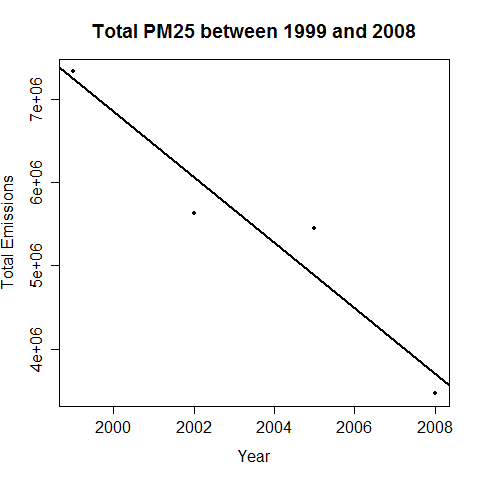

# Project 2 - Exploratory Data Analysis

## Introduction
The overall goal of this page is to explore the National Emissions Inventory database and see what it say about fine particulate matter pollution in the United states over the 10-year period 1999–2008. It presents answers and justifications to the following questions:

1. Have total emissions from PM2.5 decreased in the United States from 1999 to 2008?
2. Have total emissions from PM2.5 decreased in the Baltimore City, Maryland (fips == "24510") from 1999 to 2008?
3. Of the four types of sources indicated by the type (point, nonpoint, onroad, nonroad) variable, which of these four sources have seen decreases in emissions from 1999–2008 for Baltimore City? Which have seen increases in emissions from 1999–2008?
4. Across the United States, how have emissions from coal combustion-related sources changed from 1999–2008?
5. How have emissions from motor vehicle sources changed from 1999–2008 in Baltimore City?
6. Compare emissions from motor vehicle sources in Baltimore City with emissions from motor vehicle sources in Los Angeles County, California (fips == "06037"). Which city has seen greater changes over time in motor vehicle emissions?

## Trend of total emissions of PM2.5 in the US 1999-2008
The <b>negative slope</b> of the regression line in <a href="data/plot1.png">Plot1</a> below shows that total emissions from PM2.5 decreased in the United States between 1999 and 2008.

### Plot 1
 